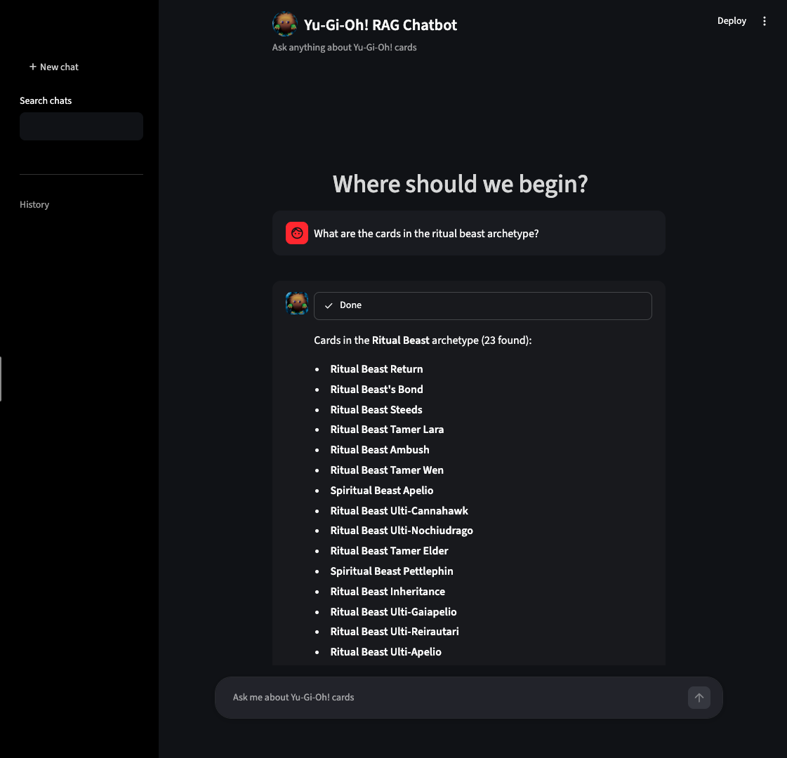
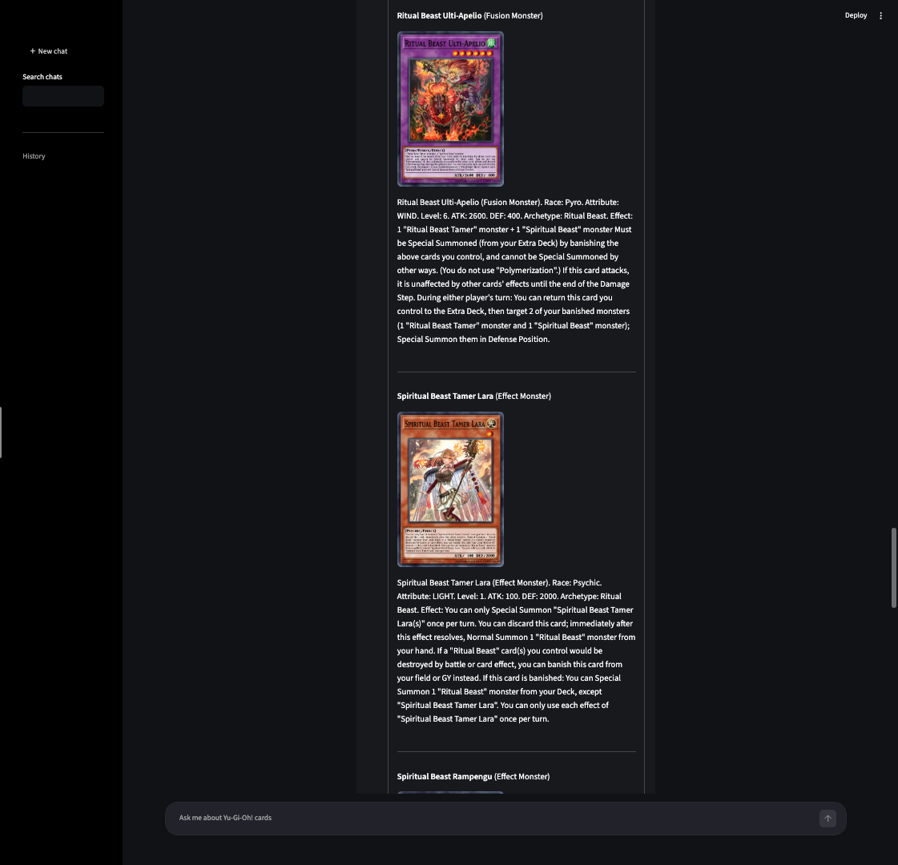

# Yu-Gi-Oh! RAG Chatbot

An AI-powered Retrieval-Augmented Generation chatbot that answers questions about Yu-Gi-Oh! cards using semantic search and a local LLM.

<p align="center">
  
  
</p>

## How it Works

This project implements a complete pipeline:
1. **Data Collection & Chunking**: Card texts, effects, and stats are processed and combined into semantic chunks.
2. **Embedding**: Card data is converted into high-dimensional vectors using Sentence Transformers.
3. **Vector Database**: Embeddings and card metadata are stored locally using **ChromaDB**.
4. **Retrieval Process**: Queries are embedded and compared against the database to fetch the most relevant cards via semantic search (enhanced with archetype and type filtering).
5. **Generation**: A local LLM takes the retrieved context and user prompt to generate accurate, context-aware answers.

## Setup

```bash
pip install -r requirements.txt
```

### 1. Fetch card data
```bash
python obtain_cards.py
```

### 2. Build embeddings and vector DB
```bash
python embedding.py
```

### 3. Run the chatbot
```bash
streamlit run streamlit_app.py
```

## Requirements
- Python 3.10+
- [Ollama](https://ollama.com/) with any local model pulled. The default is `qwen2.5:7b-instruct`, but you can use any Ollama model by replacing the model name in `streamlit_app.py`:
  ```python
  llm = ChatOllama(model="your-model-here")
  ```
