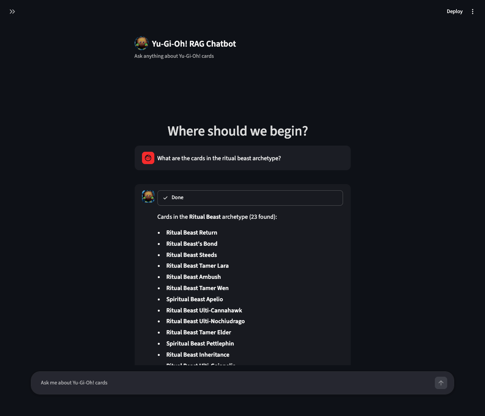

# Yu-Gi-Oh! RAG Chatbot

An AI-powered Retrieval-Augmented Generation chatbot that answers questions about Yu-Gi-Oh! cards using semantic search and a local LLM.

<p align="center">
  
  
</p>

## Setup

```bash
pip install -r requirements.txt
```

### 1. Fetch card data
```bash
python obtain_cards.py
```

### 2. Build embeddings and vector DB
```bash
python embedding.py
```

### 3. Run the chatbot
```bash
streamlit run streamlit_app.py
```

## Requirements
- Python 3.10+
- [Ollama](https://ollama.com/) with any local model pulled. The default is `qwen2.5:7b-instruct`, but you can use any Ollama model by replacing the model name in `streamlit_app.py`:
  ```python
  llm = ChatOllama(model="your-model-here")
  ```
